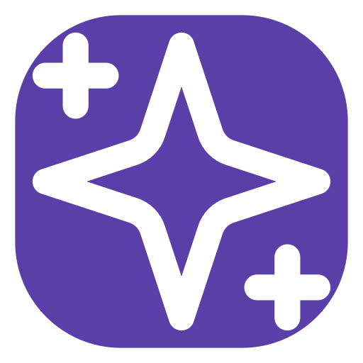
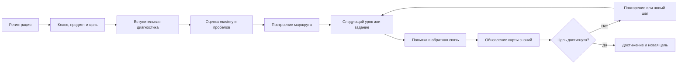
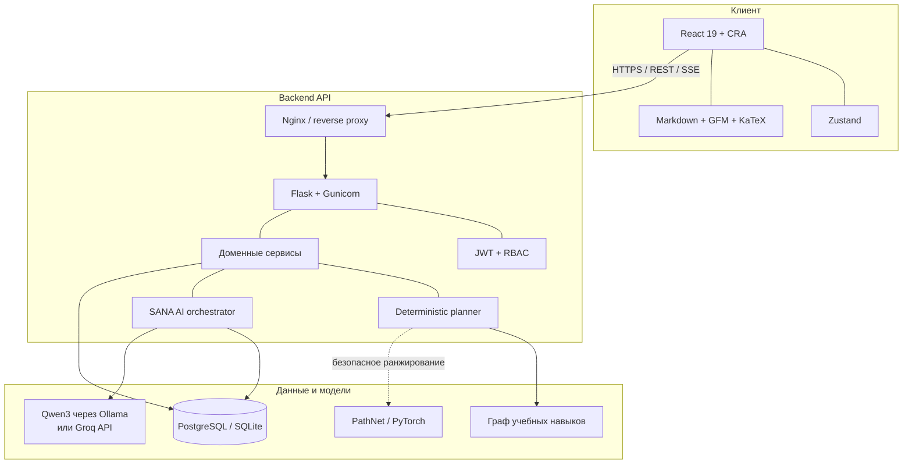
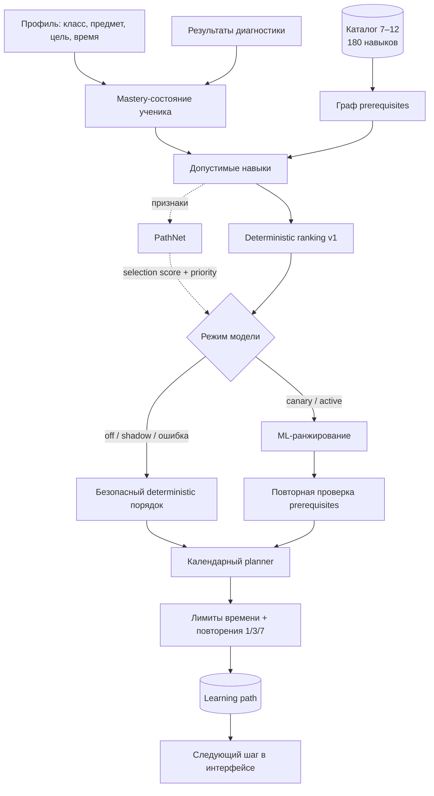
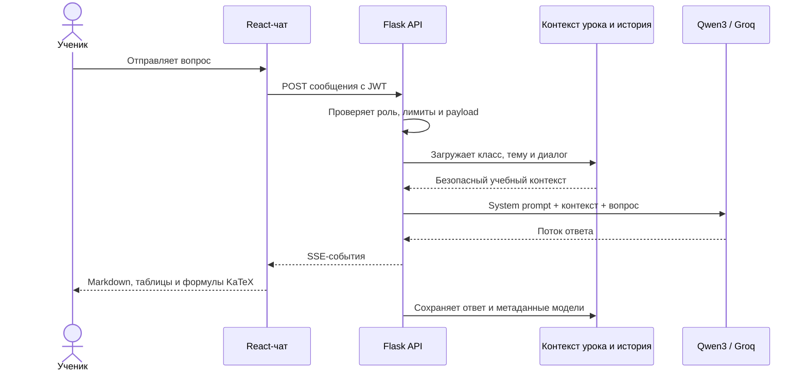

<p align="center">
  
</p>

<h1 align="center">SANAQ</h1>

<p align="center">
  <strong>Персональный учебный маршрут, который меняется вместе с учеником.</strong>
</p>

<p align="center">
  AI-платформа по математике для школьников 7–12 классов Казахстана.<br />
  Диагностика знаний, карта навыков, адаптивный план, школьные классы и персональный помощник SANA — в одном продукте.
</p>

<p align="center">
  
  
  
  
  
  
</p>

> SANAQ создаётся для трека **Social Impact** на Future Minds Hackathon 2026. Это функциональный MVP: основной путь ученика, кабинет учителя, администрирование, AI-чат и ML-контур связаны с реальным backend API.

## Содержание

- [Что такое SANAQ](#что-такое-sanaq)
- [Почему это не ещё одна платформа с видеоуроками](#почему-это-не-ещё-одна-платформа-с-видеоуроками)
- [Как продукт работает для ученика](#как-продукт-работает-для-ученика)
- [Возможности по ролям](#возможности-по-ролям)
- [Архитектура](#архитектура)
- [Как строится персональный маршрут](#как-строится-персональный-маршрут)
- [Как работает AI-помощник SANA](#как-работает-ai-помощник-sana)
- [Технологии](#технологии)
- [Быстрый локальный запуск](#быстрый-локальный-запуск)
- [Демо-аккаунты](#демо-аккаунты)
- [Запуск через Docker](#запуск-через-docker)
- [PathNet: обучение и проверка](#pathnet-обучение-и-проверка)
- [API](#api)
- [Структура репозитория](#структура-репозитория)
- [Тестирование](#тестирование)
- [Документация и дальнейшее развитие](#документация-и-дальнейшее-развитие)

## Что такое SANAQ

У двух учеников одного класса почти никогда нет одинаковых пробелов. Обычная образовательная платформа при этом показывает им одинаковую последовательность уроков. SANAQ начинает не с каталога контента, а с вопроса: **что конкретно этому ученику нужно понять следующим?**

Платформа:

1. узнаёт класс, предмет, цель и доступное время ученика;
2. проводит короткую диагностику;
3. накладывает результат на граф школьных навыков и их зависимостей;
4. строит выполнимый календарный маршрут;
5. выдаёт следующий урок или задание;
6. обновляет уровень освоения после каждой попытки;
7. перестраивает маршрут, если темп или результаты изменились.

Сейчас наиболее глубоко реализована математика: каталог охватывает **7–12 классы**, содержит **60 тем**, **180 атомарных навыков** и **201 связь предпосылок** на русском и казахском языках.

## Почему это не ещё одна платформа с видеоуроками

### 1. Живое созвездие знаний

Карта знаний показывает не список пройденных уроков, а состояние навыков:

- что уже освоено;
- что изучается сейчас;
- где обнаружен пробел;
- что заблокировано отсутствующей основой;
- что пора повторить.

Ученик видит понятный следующий шаг, а не остаётся один на один с огромным каталогом.

### 2. Маршрут учитывает реальное время

Планировщик знает, сколько минут ученик готов заниматься в будни и выходные. Он распределяет навыки по датам, учитывает зависимости и добавляет повторения через 1, 3 и 7 дней. Если всё физически не помещается в срок, система честно отмечает остаток как `unscheduled`, а не строит невыполнимый план.

### 3. SANA учит рассуждать

AI-помощник не просто выдаёт финальный ответ. Он видит контекст класса, темы и текущего урока, задаёт уточняющие вопросы, предлагает подсказки и помогает ученику пройти путь решения самостоятельно. История диалогов сохраняется, формулы отображаются через KaTeX, а структурированные ответы поддерживают списки и таблицы.

### 4. Ученик, учитель и школа находятся в одном контуре

Учитель может создать класс, публиковать объявления и материалы, назначать задания и видеть факт выполнения. Администратор управляет пользователями, классами, контентом, модерацией, системным состоянием и аудитом.

### 5. AI не получает право нарушать учебную логику

PathNet ранжирует полезные следующие навыки, но не может поставить сложную тему раньше обязательной основы. Граф предпосылок и детерминированный планировщик остаются источником жёстких ограничений. При любой ошибке модели система автоматически использует безопасный fallback.

## Как продукт работает для ученика



Главный пользовательский цикл короткий: **понять текущий уровень → получить один ясный шаг → выполнить → увидеть изменение маршрута**.

Стандартный сбалансированный режим закладывает 30 минут в будни и 45 минут в выходные. Ученик может сменить темп на лёгкий или интенсивный — после этого маршрут пересчитывается сервером.

## Возможности по ролям

| Роль | Что доступно |
|---|---|
| **Ученик** | Онбординг, диагностика, персональный маршрут, задания, уроки, карта знаний, прогресс, достижения, интервальные повторения, AI-чат, класс и настройки доступности |
| **Учитель** | Сводка класса, ученики и их прогресс, объявления, материалы, назначения, сроки, проверка выполнения, комментарии, редактор учебного контента и CSV-экспорт |
| **Администратор** | Сводка системы, пользователи и роли, классы, учебный контент, модерация, состояние сервисов, PathNet-метрики и журнал аудита |

### Интерфейс ученика

- персональная главная с ближайшим действием;
- диагностика с сохранением прогресса;
- экран генерации плана с понятными этапами;
- маршрут по датам и доступному времени;
- примитивно понятная карта знаний;
- задания разных типов: выбор, несколько вариантов, число, соответствие, сортировка и пропуски;
- объяснение ошибок без преждевременного раскрытия ответа;
- история AI-диалогов, потоковая генерация и автоматическая прокрутка;
- математические формулы, Markdown-таблицы и структурированные ответы;
- адаптивная нижняя навигация на мобильных устройствах;
- RU, KK и EN, масштаб текста, контраст, снижение анимации и озвучивание.

### Кабинет учителя

- создание класса и подключение учеников по коду;
- объявления и учебные материалы внутри класса;
- создание назначений с модулем и дедлайном;
- живой статус выполнения и прогресс класса;
- профиль ученика с освоенными и слабыми навыками;
- редактор модулей, уроков и заданий;
- предпросмотр и атомарная публикация версии контента;
- локальное автосохранение черновика и защита от конфликтов вкладок.

### Админ-панель

- обзор ключевых сущностей и состояния платформы;
- поиск, фильтрация и управление пользователями;
- изменение роли и активности аккаунта;
- управление классами и учебным контентом;
- очередь модерации AI-материалов;
- технический статус backend, базы и AI-провайдера;
- аудит административных действий;
- адаптивное компактное представление для мобильного экрана.

## Архитектура



### Принципы архитектуры

- **Backend — источник истины.** Прогресс, ответы, маршруты, роли и назначения не зависят от состояния браузера.
- **Контроллеры тонкие.** HTTP-маршруты валидируют запрос и передают работу доменным сервисам.
- **Компоненты разделены по ответственности.** Страницы, сущности, функции, виджеты и общий UI находятся в отдельных слоях.
- **ML можно отключить.** Основной учебный сценарий продолжает работать на детерминированном планировщике.
- **AI-провайдер заменяем.** Локально используется Qwen3 через Ollama, на сервере можно подключить OpenAI-совместимого провайдера.
- **Один origin в production.** Nginx отдаёт React и проксирует `/api/v1` в Flask, поэтому API-ключи никогда не попадают в браузер.

## Как строится персональный маршрут

Маршрут — не текст, сгенерированный языковой моделью. Это воспроизводимый серверный pipeline, где нейросеть помогает ранжировать варианты, а правила гарантируют корректность.



### Что учитывается

- класс и предмет;
- цель обучения;
- текущий уровень освоения каждого навыка;
- найденные диагностикой пробелы;
- зависимости между навыками;
- сложность, важность и ожидаемое время темы;
- минуты в будни и выходные;
- уже выполненные задания;
- необходимость интервального повторения.

### Режимы PathNet

| Режим | Поведение |
|---|---|
| `off` | PathNet не загружается, работает только deterministic planner |
| `shadow` | Модель считает прогноз параллельно, но не влияет на ученика; результаты пишутся для сравнения |
| `canary` | ML-ранжирование применяется к стабильной доле пользователей |
| `active` | ML-ранжирование используется для всех запросов, сохраняя проверки и fallback |

PathNet предсказывает два значения: вероятность включения навыка в ближайший маршрут и его относительный приоритет. Он компактнее языковой модели и предназначен именно для ранжирования учебных шагов.

> Текущий checkpoint обучен на синтетических траекториях учеников. Он подтверждает работоспособность ML-pipeline, но не доказывает педагогическую эффективность. До полного включения нужны обезличенные реальные события, holdout по ученикам и сравнение с deterministic baseline.

## Как работает AI-помощник SANA



SANA поддерживает отдельные диалоги и историю сообщений. Backend задаёт педагогические правила, ограничивает частоту и дневной объём генерации, хранит версию prompt и модели, а при недоступности провайдера возвращает явно обозначенный безопасный fallback.

В локальной разработке используется `qwen3:8b` через Ollama. Production Compose по умолчанию настроен на Groq, чтобы серверу не требовалось держать тяжёлую LLM в памяти. Инструкция для отдельного сервера Qwen3 находится в [backend/docs/QWEN3_SERVER_DEPLOYMENT.md](backend/docs/QWEN3_SERVER_DEPLOYMENT.md).

## Технологии

| Слой | Технологии |
|---|---|
| Frontend | React 19, **Create React App**, React Router 6, Zustand 5 |
| UI | Tailwind CSS 3, собственная дизайн-система, Lucide Icons, Manrope, Unbounded |
| Контент чата | React Markdown, GFM, remark-math, KaTeX |
| Backend | Python, Flask 3, SQLAlchemy 2, Flask-Migrate |
| Авторизация | JWT access token, HttpOnly refresh cookie, bcrypt, RBAC |
| Данные | SQLite для разработки, PostgreSQL 17 для production |
| AI | Qwen3 через Ollama или OpenAI-совместимый Groq API |
| ML | PyTorch, PathNet, pandas, matplotlib, JupyterLab |
| Production | Docker Compose, Nginx, Gunicorn |
| Тесты | pytest, React Testing Library, Jest |

> Во frontend намеренно не используется Vite. Проект создан и собирается через Create React App (`react-scripts`).

## Быстрый локальный запуск

### Требования

- Node.js 20+ и npm;
- Python 3.11+;
- Git;
- Ollama — только если нужен локальный AI-чат;
- Docker — только для контейнерного запуска.

### 1. Клонировать репозиторий

```bash
git clone https://github.com/SOGINASA/SANAQ.git
cd SANAQ
```

### 2. Запустить backend

```bash
cd backend
python3 -m venv .venv
source .venv/bin/activate
python3 -m pip install -r requirements.txt
cp .env.example .env
python3 -m flask --app app seed-demo
python3 -m flask --app app run --port 8000
```

Backend будет доступен на `http://127.0.0.1:8000`, проверка готовности — на `http://127.0.0.1:8000/api/v1/ready`.

Если `SEED_DEMO_DATA=true`, демонстрационные данные создаются при старте автоматически. Ручная команда `seed-demo` идемпотентна: её можно запускать повторно.

### 3. При необходимости запустить Qwen3

В отдельном терминале:

```bash
ollama serve
ollama pull qwen3:8b
```

Настройки из `backend/.env.example` уже направляют Flask на `http://127.0.0.1:11434`. Если AI не запущен, остальная платформа продолжит работать, а чат вернёт контролируемое сообщение о fallback.

### 4. Запустить frontend

В новом терминале из корня проекта:

```bash
cd frontend
npm install
cp .env.example .env
npm start
```

Откройте `http://localhost:3000`.

Локальный `.env` frontend должен содержать:

```env
REACT_APP_API_URL=http://127.0.0.1:8000/api/v1
REACT_APP_AI_STREAM_URL=http://127.0.0.1:8000/api/v1
REACT_APP_DEFAULT_LOCALE=ru
REACT_APP_ENABLE_MOCKS=false
REACT_APP_SHOW_DEMO_LOGIN=true
```

После изменения переменных `REACT_APP_*` перезапустите `npm start`: Create React App подставляет их во время сборки.

## Демо-аккаунты

Команда `seed-demo` создаёт три аккаунта с единым паролем `SanaqDemo2026!`.

| Роль | Email | Что показать |
|---|---|---|
| Ученик | `student@sanaq.demo` | Диагностика, маршрут, карта, задание, чат, класс |
| Учитель | `teacher@sanaq.demo` | Класс, ученики, объявления, материалы, назначения |
| Администратор | `admin@sanaq.demo` | Пользователи, классы, контент, модерация, система, аудит |

При `REACT_APP_SHOW_DEMO_LOGIN=true` эти аккаунты доступны кнопками быстрого входа. В production быстрый вход и `SEED_DEMO_DATA` должны быть выключены.

## Запуск через Docker

Полный контур включает React/Nginx, Flask/Gunicorn, PostgreSQL и PathNet. AI в корневом Compose подключается к Groq.

```bash
cp .env.production.example .env
```

Замените все `change-me` и `gsk_replace_with_server_secret`, затем выполните:

```bash
docker compose up -d --build
docker compose ps
```

По умолчанию:

- приложение: `http://localhost`;
- API через Nginx: `http://localhost/api/v1`;
- liveness: `http://localhost/api/v1/health`;
- readiness: `http://localhost/api/v1/ready`.

Логи и остановка:

```bash
docker compose logs -f backend frontend
docker compose down
```

Том `postgres_data` сохраняет базу между перезапусками. Команда `docker compose down -v` удалит этот том и все его данные — используйте её только осознанно.

Полный production-чеклист: [docs/MVP_DEPLOYMENT.md](docs/MVP_DEPLOYMENT.md). Отдельный handoff для backend-разработчика и DevOps: [backend/docs/BACKEND_HOST_HANDOFF.md](backend/docs/BACKEND_HOST_HANDOFF.md).

### Ключевые production-переменные

| Переменная | Назначение |
|---|---|
| `SECRET_KEY` | Секрет Flask |
| `JWT_SECRET_KEY` | Подпись JWT; должен отличаться от `SECRET_KEY` |
| `POSTGRES_PASSWORD` | Пароль PostgreSQL |
| `PUBLIC_ORIGIN` | Публичный origin приложения и CORS |
| `JWT_COOKIE_SECURE` | `true` на HTTPS-хосте |
| `GROQ_API_KEY` | Backend-only ключ AI-провайдера |
| `AI_MODEL` | Модель чата |
| `PATHNET_MODE` | `off`, `shadow`, `canary` или `active` |
| `PATHNET_CANARY_PERCENT` | Доля пользователей PathNet в canary-режиме |
| `SEED_DEMO_DATA` | Создание демо-данных; в production обычно `false` |

Никогда не помещайте секреты в переменные `REACT_APP_*`: они встраиваются в публичный JavaScript-бандл.

## PathNet: обучение и проверка

Обычному API PyTorch в локальной разработке не нужен. Для экспериментов создайте отдельное окружение:

```bash
cd backend
python3 -m venv .venv-ml
source .venv-ml/bin/activate
python3 -m pip install -r requirements-ml.txt
```

### Интерактивный notebook

```bash
python3 -m jupyter lab notebooks/pathnet_training_v2.ipynb
```

Notebook последовательно показывает подготовку данных, распределения признаков, обучение, loss/F1/MAE по эпохам, confusion matrix, сравнение с baseline, примеры прогнозов и сохранение checkpoint.

### Воспроизводимое обучение из CLI

```bash
python3 -m ml.simulator \
  --students 10000 \
  --seed 20260817 \
  --output ml/artifacts/synthetic-outcomes-v2-10k.jsonl.gz

python3 -m ml.train_pathnet \
  --dataset ml/artifacts/synthetic-outcomes-v2-10k.jsonl.gz \
  --output ml/artifacts/pathnet-v2-outcomes.pt \
  --epochs 12 \
  --batch-size 1024 \
  --seed 20260817 \
  --model-version pathnet-v2-synthetic-outcomes \
  --progress
```

### Shadow-оценка

Сначала запустите backend с моделью в `shadow`, вызовите построение или пересчёт нескольких маршрутов, затем:

```bash
python3 -m ml.evaluate_shadow \
  --model-version pathnet-v2-synthetic-outcomes-notebook \
  --minimum-samples 100 \
  --minimum-overlap 0.5 \
  --maximum-failure-rate 0.02 \
  --maximum-latency-ms 1000
```

Порог в один sample подходит только для smoke-проверки интеграции. Он не является основанием включать модель в `active`.

Подробности о датасете, признаках и rollout: [backend/ml/README.md](backend/ml/README.md).

## API

Все маршруты имеют префикс `/api/v1`. Успешный ответ использует envelope `data/meta`, ошибка — объект `error` с `request_id`. Идентификаторы сущностей — UUID.

| Группа | Примеры | Назначение |
|---|---|---|
| System | `GET /health`, `GET /ready`, `GET /meta` | Liveness, readiness и возможности сервера |
| Auth | `POST /auth/login`, `POST /auth/refresh`, `GET /auth/me` | Сессия и текущий пользователь |
| Profiles | `/students/me/profile`, `/teachers/me/profile` | Учебный и преподавательский профиль |
| Catalog | `/catalog/subjects/...` | Классы, предметы, темы и граф знаний |
| Diagnostics | `/diagnostics`, `/diagnostics/:id/answers` | Адаптивная диагностика |
| Learning paths | `/students/me/learning-paths`, `/learning-paths/:id` | Создание, чтение и пересчёт маршрута |
| Content | `/modules`, `/lessons`, `/tasks` | Учебные материалы и задания |
| Attempts | `/attempts` | Ответы, завершение и результат попытки |
| AI | `/ai/conversations`, `/ai/explanations`, `/ai/hints` | Чаты, streaming, объяснения и подсказки |
| Progress | `/students/me/progress`, `/students/me/knowledge-map` | Освоение и карта знаний |
| School | `/classes`, `/assignments`, `/notifications` | Классы, назначения и уведомления |
| Admin | `/admin/users`, `/admin/system`, `/admin/audit` | Управление и наблюдаемость |

Полный контракт 111 маршрутов: [backend/API_ROUTES.md](backend/API_ROUTES.md).

### Авторизация

- access token передаётся как `Authorization: Bearer <token>`;
- refresh token хранится в HttpOnly cookie;
- frontend при `401` один раз пытается обновить сессию;
- доступ ограничивается ролями `student`, `teacher`, `admin`;
- пароли хешируются через bcrypt.

## Структура репозитория

```text
SANAQ/
├── ТЗ/                              исходные материалы кейса
├── design-system/sanaq/             правила визуальной системы SANAQ
├── docs/                            продукт, деплой и ручная проверка
├── frontend/                        React-приложение на Create React App
│   ├── public/                      favicon, manifest и логотип
│   └── src/
│       ├── app/                     провайдеры и маршрутизация
│       ├── components/              layout, navigation и feedback
│       ├── entities/                сущности предметной области
│       ├── features/                самостоятельные функции продукта
│       ├── pages/                   публичные и ролевые страницы
│       ├── shared/                  API, i18n, storage, hooks и UI-kit
│       └── widgets/                 крупные блоки экранов
├── backend/
│   ├── app.py                       Flask application factory и CLI
│   ├── config.py                    настройки окружений
│   ├── models.py                    SQLAlchemy-модели
│   ├── routes/                      HTTP-контроллеры
│   ├── services/                    доменная логика
│   ├── data/curriculum/             программа математики 7–12
│   ├── ml/                          PathNet, симулятор, обучение и eval
│   ├── notebooks/                   интерактивное обучение PathNet
│   ├── tests/                       backend-тесты
│   └── API_ROUTES.md                полный API-контракт
├── compose.yaml                     production-подобный полный контур
└── .env.production.example          шаблон переменных сервера
```

Frontend следует направлению зависимостей `app → pages → widgets → features → entities → shared`. Общий компонент не должен импортировать страницу или конкретный бизнес-сценарий. Подробнее: [frontend/ARCHITECTURE.md](frontend/ARCHITECTURE.md).

## Тестирование

### Backend

```bash
cd backend
source .venv/bin/activate
python3 -m pytest -q
```

Тесты покрывают авторизацию, роли, контракт API, учебную программу, диагностику, маршруты для каждого класса 7–12, генерацию заданий, события, AI-чат, PathNet, кабинет учителя и админ-панель.

### Frontend

```bash
cd frontend
npm test -- --watchAll=false
npm run build
```

Проверяются базовый рендеринг, i18n, обработка API-ошибок, AI-чат, адаптивная навигация, teacher/admin-интерфейсы и production-сборка.

### Перед pull request

```bash
git status --short

cd backend
python3 -m pytest -q

cd ../frontend
npm test -- --watchAll=false
npm run build
```

## Безопасность и приватность

- AI-ключи существуют только на backend;
- refresh token помещается в HttpOnly cookie;
- доступ к маршрутам проверяется по роли;
- CORS задаётся явным списком origin;
- частота AI-запросов и дневное число токенов ограничены;
- аналитические события не должны содержать пароли, токены и сырые ответы;
- корректный ответ задания не раскрывается до завершения попытки;
- административные изменения попадают в аудит;
- перед production необходимо заменить все секреты и включить HTTPS с `JWT_COOKIE_SECURE=true`.

## Документация и дальнейшее развитие

| Документ | Для чего нужен |
|---|---|
| [Продуктовая концепция](docs/PRODUCT_CONCEPT.md) | Позиционирование, механика возвращаемости и сценарий демо |
| [Архитектура frontend](frontend/ARCHITECTURE.md) | Слои, зависимости, маршруты и правила файлов |
| [Backend README](backend/README.md) | Сервисы, каталог, planner, seed и backend-запуск |
| [API-контракт](backend/API_ROUTES.md) | Методы, payload и модели данных |
| [PathNet README](backend/ml/README.md) | Датасет, обучение, метрики и rollout |
| [MVP deployment](docs/MVP_DEPLOYMENT.md) | Запуск полного контура и production-чеклист |
| [Backend host handoff](backend/docs/BACKEND_HOST_HANDOFF.md) | Передача backend/ML на сервер |
| [Qwen3 deployment](backend/docs/QWEN3_SERVER_DEPLOYMENT.md) | Развёртывание локальной модели на отдельном хосте |
| [Ручное тестирование](docs/MANUAL_TESTING.md) | Проверка главных пользовательских сценариев |
| [Дизайн-система](design-system/sanaq/MASTER.md) | Цвета, типографика, компоненты и UX-принципы |

### Следующие продуктовые шаги

1. собрать обезличенные реальные учебные события и провести offline-evaluation PathNet;
2. запустить ограниченный canary после прохождения quality gates;
3. расширить проверенный банк заданий и добавить новые предметы;
4. добавить E2E-тесты критического пути ученика и учителя;
5. провести полноценный аудит WCAG с клавиатурой и скринридером;
6. добавить метрики удержания: возвращаемость, завершение шага, закрытие пробела и соблюдение плана;
7. проверить педагогические результаты вместе с учителями Казахстана.

## Короткий сценарий демонстрации

1. Войти как ученик и показать персональный маршрут и карту знаний.
2. Выполнить задание и показать изменение mastery.
3. Задать SANA вопрос с формулой и получить потоковый структурированный ответ.
4. Войти как учитель, открыть класс и увидеть выполнение назначения.
5. Создать объявление или новое назначение.
6. Войти как администратор и показать управление системой и аудит.

---

<p align="center">
  <strong>SANAQ помогает школьнику не «пройти весь курс», а понять свой следующий правильный шаг.</strong>
</p>
